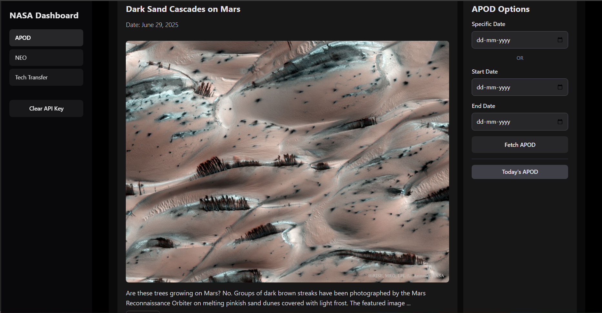

# NASA Dashboard

A comprehensive React application that provides access to multiple NASA APIs with a beautiful, responsive interface.


## Features

- 🌌 **APOD Gallery**: Browse NASA's daily astronomy images and videos
- 🚀 **NEO Tracker**: Monitor Near-Earth Objects and asteroid data
- 🛰️ **Mars Rover Photos**: Explore images from Curiosity, Opportunity, and Spirit rovers
- 🌍 **EPIC Earth Imagery**: View stunning Earth images from the DSCOVR satellite
- 📅 **Date Range Search**: View APODs from specific dates or date ranges
- 📱 **Responsive Design**: Works seamlessly on desktop, tablet, and mobile
- 🔑 **API Key Management**: Easy setup with NASA API key
- 🎯 **Interactive Navigation**: Seamless switching between different NASA data sources

## Demo



## Quick Start

### Prerequisites

- [Node.js](https://nodejs.org/) (v16 or higher recommended)
- [npm](https://www.npmjs.com/) or [yarn]

### Installation

   ```bash
   # Clone the repository
   git clone https://github.com/adityabhatkar23/nasa.git
   cd nasa

   # Install dependencies
   npm install
   # or
   yarn install
   ```

### Running Locally

```bash
# Start the development server
$ npm run dev
# or
yarn dev
```

### Get a NASA API Key

- Visit [https://api.nasa.gov/](https://api.nasa.gov/)

- Sign up for a free API key

### Add your API key

- Enter your NASA API key in the app
- Start exploring APODs!

Open [http://localhost:5173](http://localhost:5173) in your browser to use NASA Dashboard.

## Usage

### APOD (Astronomy Picture of the Day)

- **Today's APOD**: Automatically loads the latest astronomy picture
- **Specific Date**: Choose any date to view that day's APOD
- **Date Range**: Select start and end dates to browse multiple APODs
- **Pagination**: Navigate through large collections with ease

### NEO (Near-Earth Objects)

- **Asteroid Tracking**: Monitor asteroids that approach Earth
- **Detailed Information**: View size, distance, velocity, and hazard data
- **Date Filtering**: Search for asteroids on specific dates
- **Hazard Assessment**: Identify potentially hazardous asteroids

### Mars Rover Photos

- **Multiple Rovers**: Explore images from Curiosity, Opportunity, and Spirit
- **Camera Selection**: Choose from different rover cameras (FHAZ, RHAZ, MAST, etc.)
- **Sol-based Search**: Search by Martian day (sol)
- **High-Resolution Images**: View and download full-resolution rover photos

### EPIC Earth Imagery

- **Daily Earth Views**: See Earth from the DSCOVR satellite
- **Date Selection**: Pick any date to view Earth imagery
- **Image Navigation**: Browse through multiple images per day with Previous/Next buttons
- **Time Information**: View exact capture times and image details

## Tech Stack

- **React 18** - UI framework
- **React Router** - Navigation
- **Tailwind CSS** - Styling
- **NASA APOD API** - Data source
- **Vite** - Build tool

## API Reference

This project uses multiple NASA APIs:

### APOD API

- **Endpoint**: `https://api.nasa.gov/planetary/apod`
- **Purpose**: Astronomy Picture of the Day
- **Authentication**: API key required
- **Rate Limit**: 1000 requests per hour (free tier)

### NEO API

- **Endpoint**: `https://api.nasa.gov/neo/rest/v1/feed`
- **Purpose**: Near-Earth Object data
- **Authentication**: API key required
- **Rate Limit**: 1000 requests per hour (free tier)

### Mars Rover Photos API

- **Endpoint**: `https://api.nasa.gov/mars-photos/api/v1/rovers/{rover}/photos`
- **Purpose**: Mars rover imagery
- **Authentication**: API key required
- **Rate Limit**: 1000 requests per hour (free tier)

### EPIC API

- **Endpoint**: `https://api.nasa.gov/EPIC/api/natural/date/{date}`
- **Purpose**: Earth imagery from DSCOVR satellite
- **Authentication**: API key required
- **Rate Limit**: 1000 requests per hour (free tier)

## License

MIT License - feel free to use this project for your own purposes.

---

Built with ❤️ by [Aditya](https://adityabhatkar23.github.io/portfolio/) using NASA's amazing API
